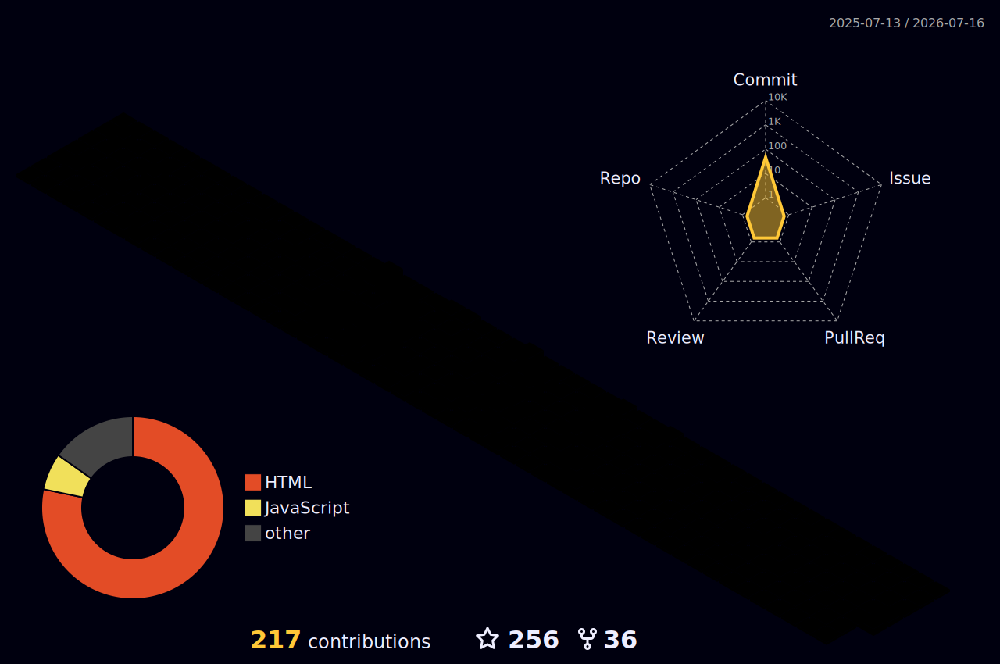

### Hi there 👋

- 🤣 一个牛马
- 😣 这几年在搞 Agent
- ✏️ 平时想起来就写点 [博客](https://ruvikm.github.io/)

 

---

[)](https://git.io/typing-svg)

---

## 📊 GitHub Stats

---

## 🧰 Tech Stack

---

## 🌈 Contribution Graph

